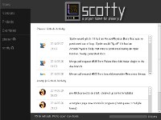
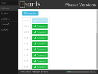
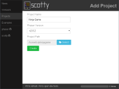
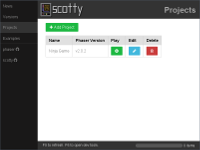

### Welcome to scotty.js
------------------------
scotty is a project toolkit for the [Phaser](http://phaser.io) HTML5 game framework.

scotty lets you:

* Download multiple versions of Phaser, so you can select which version to install alongside each of your Game Projects
* Download the latest Phaser Examples
* Manage your Game Projects and run them from the app

### Getting Started
-------------------
To use scotty, download and unzip the release for your operating system [here](https://github.com/tchannel/scottyjs/releases/latest). Once the project is unzipped, run the `scotty-gui` executable.

### Screenshots
---------------

